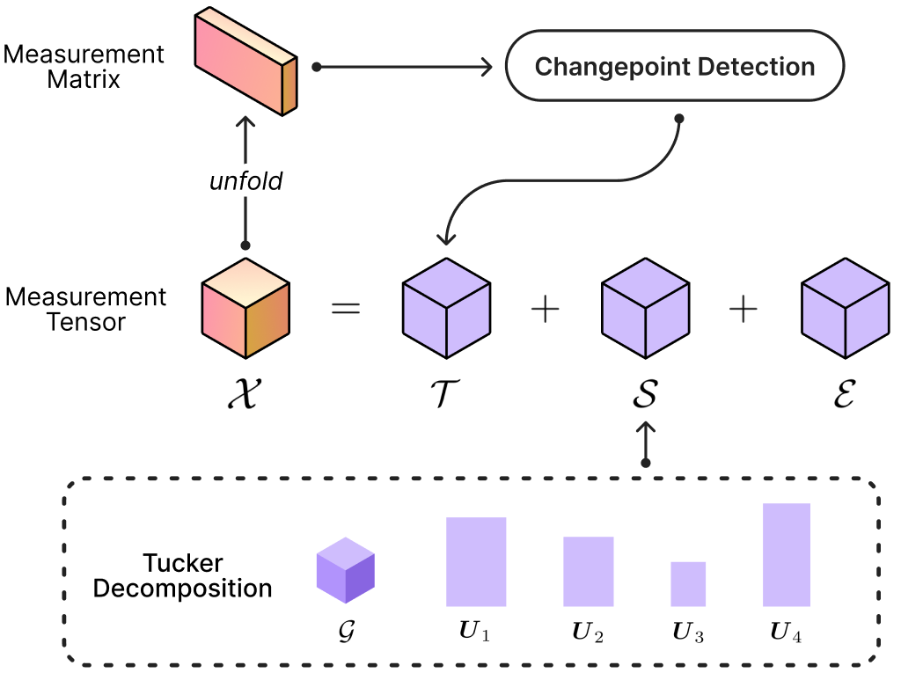
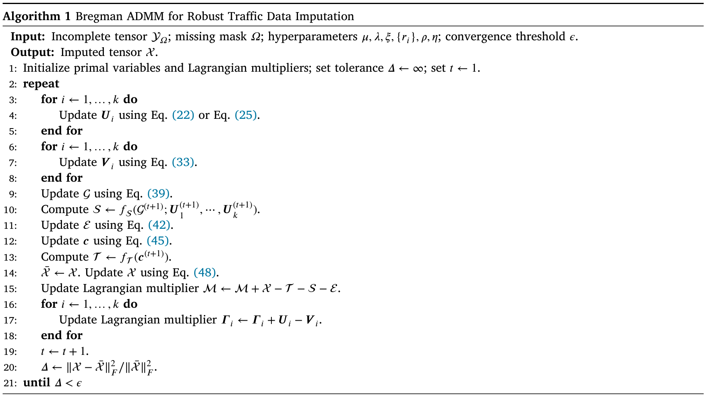

<h1 style="text-align: center;">Robust Tucker Tensor Completion</h1>





## Setup

1. **Install dependencies**. To install the required dependencies, run the following command:

    ```bash
    pip install -r requirements.txt
    ```

2. **Download datasets**. Download the datasets from the following links:

    - [Guangzhou](https://zenodo.org/records/1205229)
    - [T4C-S](https://drive.google.com/file/d/1g5RxbLv_LA1UxI1L7hUotBzxW7Zdc3-G/view?usp=sharing)

    Extract the datasets to the `data/` directory. The file structure should look like this:

    ```
    data/
    ├── guangzhou/
    │   ├── tensor.mat
    ├── t4c-s/
    │   ├── london_tensor.npy
    │   ├── madrid_tensor.npy
    │   ├── melbourne_tensor.npy
    ``` 


3. **Initialize logger**. To log the results to [wandb](https://wandb.ai/), run the following command:

    ```bash
    wandb login
    ```

## Usage

The algorithm runs in two sequential steps: (1) Generate changepoints using the PELT algorithm, and (2) Impute the missing values using the tensor completion algorithm.

1. **Changepoint detection using PELT algorithm**. To generate changepoints for a dataset with given missing rates and corresponding penalties, run the following command:

    ```bash
    python changepoint.py --city t4c-london --data_path data/ --cpt_path data/changepoints/ --mr1 0.3 --mr2 0.1 --mr3 0.3 --mr4 0.1 --minsize 3 --pen 30 --missseed 33 --njobs 16
    ```

2. **Main imputation algorithm**. To run the main imputation algorithm, use the following command:

    ```bash
    python main.py --city t4c-london --data_path data/ --cpt_path data/changepoints/ --mr1 0.3 --mr2 0.1 --mr3 0.3 --mr4 0.1 --wandb_proj rttc --save_tensor
    ```



## References

If you use this code in your research, please cite the following paper:

```bibtex
@article{lyu:rttc-2024,
  title = {Tucker Factorization-Based Tensor Completion for Robust Traffic Data Imputation},
  author = {Lyu, Cheng and Lu, Qing-Long and Wu, Xinhua and Antoniou, Constantinos},
  year = {2024},
  journal = {Transportation Research Part C: Emerging Technologies},
  volume = {160},
  pages = {104502},
  doi = {10.1016/j.trc.2024.104502},
}
```